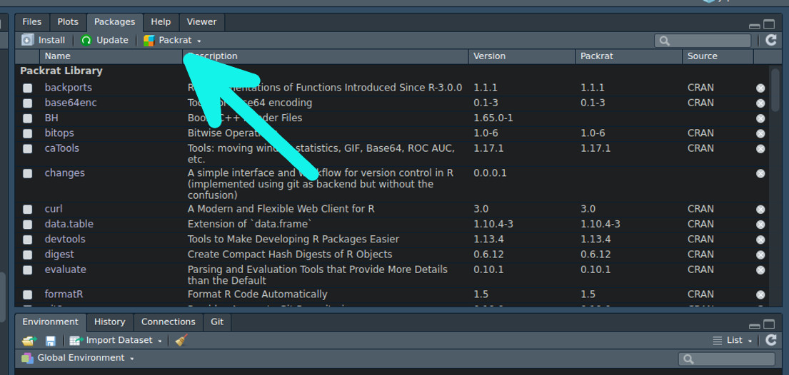

```{r setup, include=FALSE}
knitr::opts_chunk$set(echo=TRUE, eval=FALSE)
```

# イントロ

## だれ？

<div class="column1">
- fuuuumin @twitter(fuuumin314)
- R歴 3年
- 医学部
- 近況: 国家試験やばい
</div>
<div class="column2">

</div>


## だれへのお話？
- 初心者を脱しようとしている(関数に対して抵抗がない)
- 非エンジニア向け

# Rで分析するとき以外の問題

## 例えば…… 
1. 私の環境では動いたよ？
1. 分析過程の履歴をとりたい

# 私の環境では動いたよ？

## 解決法

1. 手動管理: `devtools::session_info()`
1. [packrat package](https://rstudio.github.io/packrat/): R Studio で操作可能
1. [Docker](https://github.com/rocker-org/rocker/wiki/Using-the-RStudio-image): 今回は割愛. 環境構築に便利そう.


## 手動管理
- レポートのどこかに記しておく
- ~~だるい (DRY)~~

## devtoolsを利用して(1)
```{r, eval=TRUE}
devtools::session_info()[[1]]
```

## devtoolsを利用して(2)
```{r, eval=TRUE}
devtools::session_info()[[2]]
```

## packrat
- Projectに固有のpackageを構築
- Rstudioから直接使える
- CRAN, bioconductor, githubを問わずソースを保存
- パッケージの状態を共有しやすくする

## 使い方

- packratを始める
```{r}
packrat::init()
```
- 使用しているパッケージを固める
```{r}
packrat::snapshot()
```

## 現在のパッケージ状態は？

```{r eval=TRUE}
packrat::status()
```


## RStudio なら
- Use packrat in this projectから始められる


## 追加資料
- @dichikaさん [packratで人類の拡大再生産に貢献する](http://d.hatena.ne.jp/dichika/20131220/p1)
- @uriboさん [packratの使い道を考えてみた](https://qiita.com/uri/items/5d473a5df91954585e62)

# 分析過程の履歴をとりたい

## 自分でVersion Control System
- 他の人が見たときに分かりづらい
- もうfinal_analysis_06.Rmdは嫌だ！
- だが、黒い画面が嫌いな人もいる

## [ropenscilabs/changes](https://github.com/ropenscilabs/changes)
- gitを非エンジニアに身近に
- gitの用語より平易
- インストールは、
```{r}
devtools::install_github("ropenscilabs/changes")
# githubinstall でインストールできませんでした
```

## 機能
- バージョンコントロールを始める
```{r}
changes::create_repo()
```
- 履歴に書き込む
```{r}
changes::record()
```
- ある変更時点へ飛ぶ
```{r}
changes::go_to()
# ここ変えた
```

## 実際のログ

- 履歴を見る
```{r, eval=TRUE}
changes::timeline()
```

## まとめ
- 分析そのもの以外で楽できる方法を紹介(Packrat, changes)
- レベルに合わせて、ツールを使ってRで楽をしよう.
- @kazutanさんの資料のおかげで、このスライドは楽にできました.ありがとう、ぞうさん

## Enjoy! 


## 参考資料
- [Good enough practices in scientific computing](http://journals.plos.org/ploscompbiol/article?id=10.1371/journal.pcbi.1005510): どうやったらよりよい統計解析が行えるか.
- [Data Science is Software | SciPy 2016 Tutorial | Peter Bull & Isaac Slavitt](https://www.youtube.com/watch?v=EKUy0TSLg04&t=6924s&list=LLGHuJ-zAjTfYElCRKIi2KsQ&index=69): データ解析をCS視点で解説.長いがためになる.

